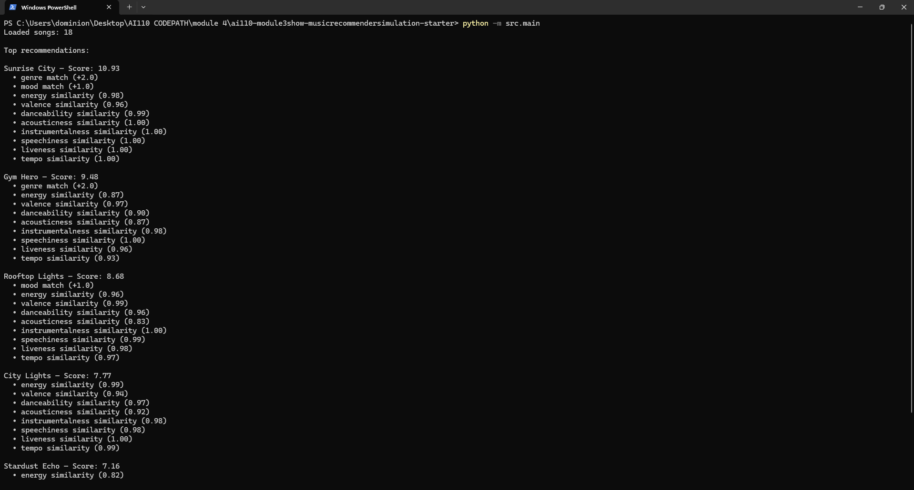
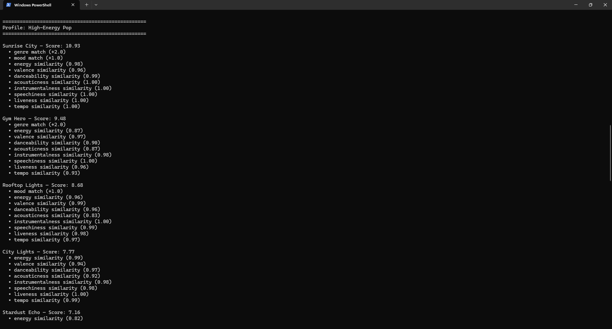
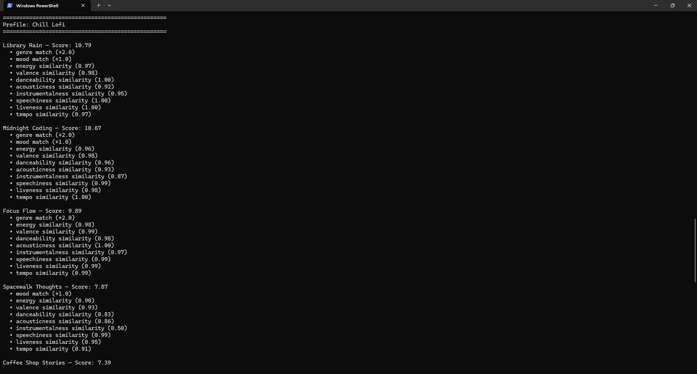
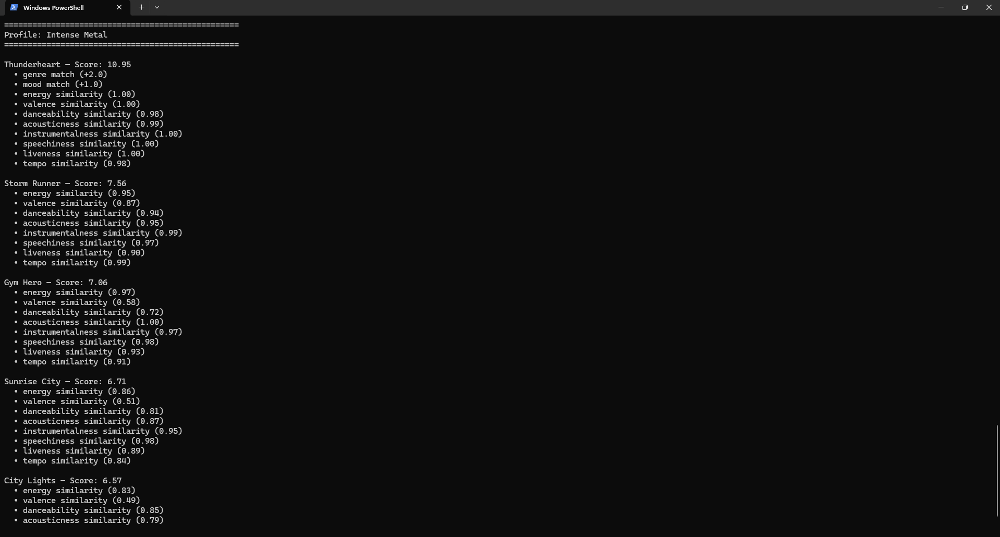

# 🎵 Music Recommender Simulation

## Project Summary

This project simulates a content-based music recommender system. It loads an 18-song catalog from a CSV file, compares each song's features against a user's taste profile, and returns the top ranked suggestions with a score and explanation for each. The system scores songs using genre and mood matches plus numerical similarity across energy, valence, tempo, danceability, acousticness, instrumentalness, speechiness, and liveness.

---

## How The System Works

Real-world recommenders like Spotify use collaborative filtering (what similar users listened to) and content-based filtering (the actual attributes of songs). My version focuses on content-based filtering. It compares each song's features — genre, mood, energy, and valence — against a user's taste profile.
Genre matches earn the most points (+2.0), mood matches earn +1.0, and numerical features like energy are scored by closeness to the user's target value (1 - |user_target - song_value|). The system then ranks all songs by total score and returns the top results.
Features used per Song: genre, mood, energy, valence
Features stored in UserProfile: favorite_genre, favorite_mood, target_energy, target_valence


Algorithm Recipe:

Genre match → +2.0 points
Mood match → +1.0 point
Energy, valence, tempo, danceability, acousticness, instrumentalness, speechiness, liveness → each scored as 1 - |user_target - song_value| (max 1.0 each)
Potential bias: genre match alone (+2.0) outweighs any single numerical feature (max 1.0), so genre may dominate recommendations.

---

## Getting Started

### Setup

1. Create a virtual environment (optional but recommended):

   ```bash
   python -m venv .venv
   source .venv/bin/activate      # Mac or Linux
   .venv\Scripts\activate         # Windows

2. Install dependencies

```bash
pip install -r requirements.txt
```

3. Run the app:

```bash
python -m src.main
```

### Running Tests

Run the starter tests with:

```bash
pytest
```

You can add more tests in `tests/test_recommender.py`.

---

## Experiments You Tried

Experiment — Weight Shift: Doubled energy weight from 1.0 to 2.0. Score gaps widened and Neon Skyline climbed from 4th to 2nd in the Extreme Acoustic High-Energy profile, but top-ranked songs stayed the same across all profiles. Concluded that categorical matches still dominate even with higher energy weight. Reverted to 1.0 after the experiment.

---

## Limitations and Risks

The system only works on a catalog of 18 songs, which is far too small for meaningful diversity. It does not understand lyrics, context, or listening history. It treats all features as equally important except genre, which is weighted higher and can dominate results even when mood contradicts the user's preference. Genres with only one song in the catalog will always produce that song as the top result regardless of how poor the overall fit is.

---

## Reflection

My biggest learning moment in this project was discovering how a single weight decision of giving genre +2.0 points could shape every result the system produces. I designed the scoring to feel balanced, but testing revealed that genre dominates even when it contradicts what the user actually wants. That taught me that bias in a recommender isn't always obvious. It hides inside small design choices that seem reasonable at first.
AI tools helped me move faster throughout the project, generating boilerplate, suggesting adversarial test profiles, and catching structural patterns I might have missed. But I had to stay alert. The AI agent introduced real bugs including a wrong variable name and dead code after return statements that would have broken the program.
What surprised me most was how convincing simple math can feel. The system has no understanding of music at all, it just measures how close numbers are, but for profiles like pop or lofi, the recommendations felt right. If I extended this project, I would add a diversity filter, a warning system for weak matches, and a larger catalog to give the scoring logic more meaningful options to work with.

---


## Terminal Output

### Different Feels/Moods Profile


### Pop/Happy Profile


### Chill Lofi Profile


### Intense Metal Profile
