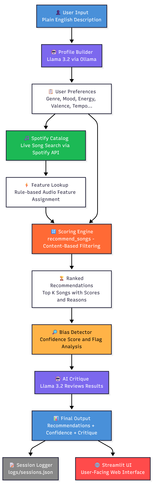

# 🎵 MusicTasteMatch 2.0

> An AI-powered music recommendation system that turns natural language descriptions into personalized song suggestions using live Spotify data, local AI inference, bias detection, and session logging.

---

## 📌 Base Project

This project extends **MusicTasteMatch 1.0** (Module 3 — Music Recommender Simulation).

The original system loaded a static 18-song CSV catalog, scored songs against a hardcoded user profile using genre/mood matching and numerical similarity, and returned ranked recommendations via the terminal. It had no AI components, no live data, and no evaluation layer.

---

## 🚀 What's New in 2.0

| Component | 1.0 | 2.0 |
|---|---|---|
| Music catalog | Static 18-song CSV | Live Spotify API |
| User profile | Hardcoded dictionary | Natural language → AI-generated |
| AI inference | None | Llama 3.2 via Ollama (local, free) |
| Bias detection | None | Automated confidence scoring |
| Self-critique | None | AI reviews its own recommendations |
| Session logging | None | JSON log of every session |
| Interface | Terminal only | Streamlit web app |

---

## 🏗️ Architecture Overview



The system runs in six sequential steps:

1. **Profile Builder** — Llama 3.2 reads the user's plain English description and outputs a structured preference profile (genre, mood, energy, valence, tempo, etc.)
2. **Spotify Catalog** — Searches Spotify's live catalog for songs matching the genre and mood, then assigns audio features using a rule-based lookup table
3. **Scoring Engine** — Scores every song against the user profile using genre/mood matching (+2.0/+1.0) and numerical similarity
4. **Bias Detector** — Analyzes the results for genre dominance, catalog imbalance, contradictory preferences, and missing matches — outputs a confidence score from 0.0 to 1.0
5. **AI Critique** — Llama 3.2 reviews the recommendations and flags mismatches with a 2-3 sentence honest assessment
6. **Session Logger** — Writes every session to `logs/sessions.json` for auditability

---

## ⚙️ Setup Instructions

### Prerequisites
- Python 3.11+
- [Ollama](https://ollama.com/download) installed and running
- Spotify Developer account (free) with Client ID and Secret
- Anthropic API key (optional — for future Claude integration)

### 1. Clone the repo
```bash
git clone https://github.com/fortdominz/musictastematch-applied-ai.git
cd musictastematch-applied-ai
```

### 2. Install dependencies
```bash
pip install -r requirements.txt
```

### 3. Pull the Llama model
```bash
ollama pull llama3.2
```

### 4. Set up environment variables
Create a `.env` file in the project root:

SPOTIFY_CLIENT_ID=your_spotify_client_id
SPOTIFY_CLIENT_SECRET=your_spotify_client_secret
ANTHROPIC_API_KEY=your_anthropic_key_optional

### 5. Run the Streamlit app
```bash
streamlit run streamlit_app.py
```

### 6. Or run the CLI version
```bash
python -m src.app
```

### 7. Run tests
```bash
pytest tests/ -v
```

---

## 💬 Sample Interactions

### Input 1: "I want something to study to late at night"
**Profile built:** lofi / relaxed / energy 0.5
**Top result:** Lofi Relaxed Paws by Lo-fi Soul Architect — Score: 10.55
**Confidence:** 0.9 / 1.0
**AI Critique:** Recommendations align with the lofi study vibe. One track (Loft Music by The Weeknd) appears as a genre mismatch and should be filtered out by stricter genre classification.

---

### Input 2: "Give me high energy songs for the gym"
**Profile built:** electronic / energetic / energy 0.9
**Top result:** Energetic Excitement by Bumthesyx — Score: 10.45
**Confidence:** 1.0 / 1.0 — No bias flags
**AI Critique:** Strong alignment with high-energy electronic targets. All top 5 results match genre and mood.

---

### Input 3: "Something sad and acoustic for a rainy day"
**Profile built:** folk / moody / energy 0.3
**Top result:** Ophelia by The Lumineers — Score: 10.05
**Confidence:** 1.0 / 1.0 — No bias flags
**AI Critique:** Results capture the folk/moody atmosphere well. Valence targeting could be refined to better distinguish degrees of sadness across tracks.

---

## 🧠 Design Decisions

**Why Ollama instead of a cloud API?**
Ollama runs Llama 3.2 locally — no cost, no data sent to external servers, no rate limits. The tradeoff is speed: local CPU inference takes 30-60 seconds per call. Future versions will swap in the Anthropic API for near-instant responses.

**Why rule-based feature lookup instead of AI estimation?**
Initial versions used Llama to estimate audio features per song, which added 10+ minutes of inference time. A genre/mood lookup table produces consistent, instant results and keeps AI calls focused on the two highest-value tasks: understanding the user's description and critiquing the output.

**Why content-based filtering over collaborative filtering?**
Collaborative filtering requires user history data we don't have. Content-based filtering works from song attributes alone, making it reproducible and explainable — every recommendation comes with a breakdown of exactly why it ranked where it did.

**Why Spotify for the catalog?**
Spotify's search API is free, returns real songs from a catalog of 100 million tracks, and requires no OAuth for basic search. This gives the system genuine diversity that a static CSV never could.

---

## 🧪 Testing Summary

9 automated tests across three test files:

- `tests/test_recommender.py` — OOP recommender: sorting, explanation output (2 tests)
- `tests/test_system.py` — Bias detector, logger, scoring engine (9 tests)

**Results:** 9/9 passed in 0.35 seconds

**Key findings:**
- Bias detector correctly flags nonexistent genre/mood combinations
- Contradictory preference detection (high energy + high acousticness) works as expected
- Logger produces valid JSON on every session
- Scoring engine always returns results sorted highest to lowest

**What didn't work:** Llama occasionally returns malformed JSON for batch feature estimation. Resolved with a fallback to rule-based defaults.

---

## 🎥 Demo Walkthrough

> 🔗 Loom video link — *to be added after recording*

---

## 🔍 Limitations and Risks

- Spotify search results vary — the same query may return different songs each run
- Llama 3.2 running locally is slow (~30-60 seconds per call on CPU)
- Genre/mood feature lookup table uses fixed values — two lofi songs get identical numerical features
- The system has no memory of previous sessions or user history
- Confidence scoring penalizes low score gaps which may not always indicate poor results

---

## 💭 Reflection

Building MusicTasteMatch 2.0 taught me how much complexity lives between "the AI understood the user" and "the AI gave good results." The profile builder works well — Llama consistently maps natural language to sensible genre/mood pairs. But the catalog step revealed a fundamental tension: Spotify's audio features API was deprecated for new developers in 2024, forcing us to pivot from AI-estimated features to a rule-based lookup table. That pivot actually improved consistency, which was an unexpected lesson about when simpler is better.

The bias detection layer was the most valuable addition. Attaching a confidence score to every result set makes the system honest about its own limitations in a way that feels genuinely useful. Real recommenders rarely do this — they present every result with equal confidence regardless of how weak the match actually is.

---

## 📁 Project Structure

musictastematch-applied-ai/
├── assets/
│   └── architecture.png
├── data/
│   └── songs.csv
├── logs/
│   └── sessions.json
├── src/
│   ├── app.py
│   ├── bias_detector.py
│   ├── critique.py
│   ├── logger.py
│   ├── profile_builder.py
│   ├── recommender.py
│   ├── spotify_catalog.py
│   └── init.py
├── tests/
│   ├── test_recommender.py
│   └── test_system.py
├── streamlit_app.py
├── conftest.py
├── model_card.md
├── requirements.txt
└── README.md
